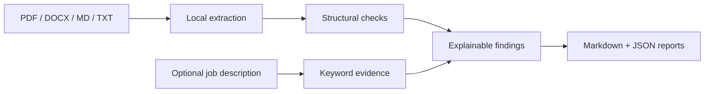

# Local ATS Auditor

[](https://github.com/HimavanthMahesh/local-ats-auditor/actions/workflows/ci.yml)
[](https://www.python.org/)
[](LICENSE)

A privacy-first command-line tool that audits PDF, DOCX, Markdown, and plain-text resumes for common parsing risks and compares supported technical terms with a job description.

The auditor is deterministic and runs entirely on the user's computer. It does not upload documents, call an LLM, or pretend to reproduce a proprietary employer ATS. Every score is an inspectable diagnostic—not an interview prediction.

This repository uses synthetic fixtures and contains no real candidate resume or profile.

## Why this project exists

Most online resume scanners require candidates to upload sensitive employment and contact information, while returning an unexplained score. Local ATS Auditor takes the opposite approach:

- **Local by default:** resume and job text never leave the machine.
- **Explainable:** each warning includes the evidence and a corrective action.
- **Reproducible:** the same inputs produce the same result.
- **Truth-preserving:** missing keywords are suggestions for review, never instructions to invent experience.

## What it checks

| Area | Checks |
| --- | --- |
| Extraction | Readable text, line count, standard section recognition, contact fields |
| DOCX structure | Tables, text boxes, images, header/footer text, smallest detected font |
| PDF structure | Page count, extracted text per page, embedded images |
| Resume quality | Reverse chronology, bullet count, action verbs, quantified scope, word count, placeholders |
| Job alignment | Transparent coverage of a curated technical vocabulary in a supplied job description |
| Reporting | Human-readable Markdown and machine-readable JSON |



## Quick start

Requirements: Python 3.11 or newer.

```bash
git clone https://github.com/HimavanthMahesh/local-ats-auditor.git
cd local-ats-auditor
python3 -m venv .venv
source .venv/bin/activate
python -m pip install -e .
```

Run the included synthetic example:

```bash
local-ats-auditor \
  --resume examples/sample_resume.md \
  --job-description examples/sample_job.txt \
  --json reports/example.json \
  --markdown reports/example.md \
  --strict
```

Audit your own document:

```bash
local-ats-auditor \
  --resume /path/to/resume.pdf \
  --job-description /path/to/job.txt \
  --json reports/result.json \
  --markdown reports/result.md
```

The ignored `reports/` directory is intended for private outputs. Review every file before sharing it.

### Optional SQLite ledger input

If a job description is stored in a local SQLite database with a `jobs(job_id, description)` table, it can be loaded without copying the text into another file:

```bash
local-ats-auditor \
  --resume /path/to/resume.pdf \
  --ledger /path/to/job_pipeline.sqlite \
  --job-id 123 \
  --markdown reports/job-123.md
```

## Interpreting the result

- **Structural readiness (0–80)** summarizes extraction, format safety, and evidence-writing checks.
- **Job-specific coverage (0–20)** reports only curated technical terms present in the supplied job description.
- **Strict mode** exits with status `2` when a high-severity finding is present, which makes it useful in automated workflows.

A high score cannot overcome missing eligibility, seniority, required experience, or sponsorship constraints. A missing term should be added only when it accurately describes verified experience.

## Tests

```bash
python -m unittest discover -s tests -v
```

GitHub Actions runs the test suite on Python 3.11, 3.12, and 3.13 and performs a strict scan of the synthetic example.

## Scope and limitations

- This is an independent diagnostic tool, not an official Greenhouse, Lever, Ashby, Workday, or employer product.
- Employer systems use private rules that cannot be inferred from a local score.
- Keyword coverage is intentionally narrow and does not measure semantic equivalence or candidate quality.
- Layout checks are strongest for DOCX; PDFs expose less formatting metadata.
- The tool does not rewrite resumes or generate claims.

See [PLAN.md](PLAN.md) for the roadmap and [SECURITY.md](SECURITY.md) for safe handling and vulnerability reporting.

## Evidence basis

The initial rules follow public guidance from [MIT Career Advising and Professional Development](https://capd.mit.edu/resources/make-your-resume-ats-friendly/) and [Greenhouse Support](https://support.greenhouse.io/hc/en-us/articles/200989175-Unsuccessful-resume-parse): use a simple structure, keep contact details in the document body, avoid decorative layout elements that disrupt reading order, and verify extracted text.

## License

[MIT](LICENSE)
